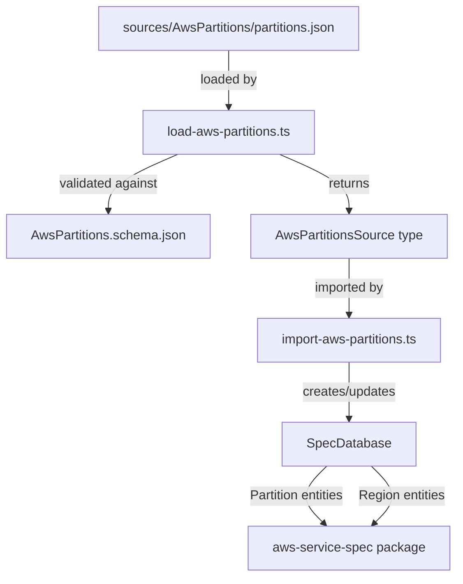
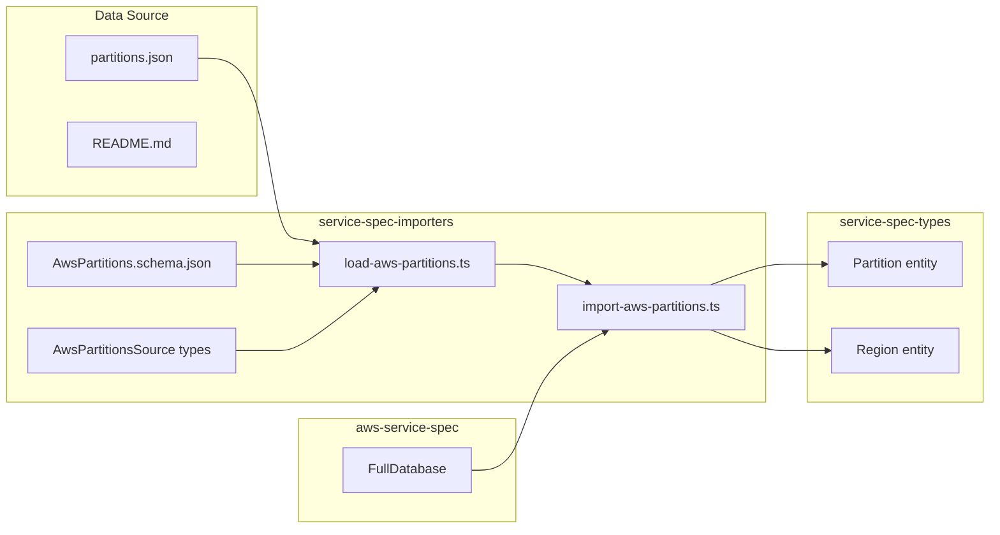

# Design Document: AWS Regions Data Source

## Overview

This design document describes the implementation of a new data source for AWS partitions and regions using the AWS SDK JS v3 `partitions.json` file. The data source will follow the established patterns in the codebase for data sources like StatefulResources and SAMSpec.

The implementation adds partition and region metadata to the service specification database, enabling CDK developers to access information about AWS partitions (aws, aws-cn, aws-us-gov, aws-iso, aws-iso-b) and their associated regions.

## Architecture

The solution follows the existing data flow pattern in the codebase:



### Component Integration



## Components and Interfaces

### 1. Data Source Directory (`sources/AwsPartitions/`)

The data source directory contains:
- `partitions.json`: The raw partition and region data from AWS SDK JS v3
- `README.md`: Documentation explaining the source and its purpose

### 2. Source Schema Types (`service-spec-importers/src/types/aws-partitions/`)

TypeScript interfaces representing the raw JSON structure from the AWS SDK:

```typescript
// AwsPartitionsSource.ts
export interface AwsPartitionsSource {
  readonly version: string;
  readonly partitions: AwsPartitionData[];
}

export interface AwsPartitionData {
  readonly id: string;
  readonly regionRegex: string;
  readonly regions: Record<string, AwsRegionData>;
  readonly outputs: AwsPartitionOutputs;
}

export interface AwsRegionData {
  readonly description?: string;
}

export interface AwsPartitionOutputs {
  readonly dnsSuffix: string;
  readonly dualStackDnsSuffix: string;
  readonly supportsFIPS: boolean;
  readonly supportsDualStack: boolean;
  readonly implicitGlobalRegion: string;
  readonly name?: string;
}
```

### 3. JSON Schema (`service-spec-importers/schemas/AwsPartitions.schema.json`)

JSON Schema for validating the partitions.json file structure. Generated from TypeScript types using `ts-json-schema-generator`.

### 4. Loader (`service-spec-importers/src/loaders/load-aws-partitions.ts`)

```typescript
import { assertSuccess } from '@cdklabs/tskb';
import { Loader, LoadResult, LoadSourceOptions } from './loader';
import { AwsPartitionsSource } from '../types';

export async function loadAwsPartitions(
  filePath: string,
  options: LoadSourceOptions = {},
): Promise<LoadResult<AwsPartitionsSource>> {
  const loader = await Loader.fromSchemaFile<AwsPartitionsSource>('AwsPartitions.schema.json', {
    mustValidate: options.validate,
  });

  const result = await loader.loadFile(filePath);
  assertSuccess(result);
  return result;
}
```

### 5. Importer (`service-spec-importers/src/importers/import-aws-partitions.ts`)

```typescript
import { SpecDatabase, Partition, Region } from '@aws-cdk/service-spec-types';
import { AwsPartitionsSource } from '../types';

export function importAwsPartitions(db: SpecDatabase, source: AwsPartitionsSource) {
  for (const partitionData of source.partitions) {
    // Create or update Partition entity
    const partition = db.allocate('partition', {
      partition: partitionData.id,
      dnsSuffix: partitionData.outputs.dnsSuffix,
      regionRegex: partitionData.regionRegex,
    });

    // Create Region entities for each region in the partition
    for (const [regionName, regionData] of Object.entries(partitionData.regions)) {
      const region = db.lookup('region', 'name', 'equals', regionName)[0] 
        ?? db.allocate('region', {
          name: regionName,
          description: regionData.description,
        });
      
      // Link region to partition
      db.link('hasRegion', partition, region);
    }
  }
}
```

### 6. DatabaseBuilder Integration

Add method to `DatabaseBuilder` class:

```typescript
public importAwsPartitions(filePath: string) {
  return this.addSourceImporter(async (db, report) => {
    const partitions = this.loadResult(await loadAwsPartitions(filePath, this.options), report);
    importAwsPartitions(db, partitions);
  });
}
```

### 7. Projen Configuration

Add to `.projenrc.ts`:

```typescript
new SingleSource(repo, {
  name: 'aws-partitions',
  dir: 'sources/AwsPartitions',
  source: 'https://raw.githubusercontent.com/aws/aws-sdk-js-v3/main/packages/util-endpoints/src/lib/aws/partitions.json',
});
```

## Data Models

### Existing Entities (service-spec-types)

The `Partition` and `Region` entities already exist in `service-spec-types/src/types/resource.ts`:

```typescript
export interface Partition extends Entity {
  readonly partition: string;
}

export interface Region extends Entity {
  readonly name: string;
  readonly description?: string;
}

export type HasRegion = Relationship<Partition, Region, { isPrimary?: boolean }>;
```

### Extended Partition Entity

The existing `Partition` interface needs to be extended to include additional metadata:

```typescript
export interface Partition extends Entity {
  readonly partition: string;
  readonly dnsSuffix?: string;
  readonly dualStackDnsSuffix?: string;
  readonly regionRegex?: string;
  readonly supportsFIPS?: boolean;
  readonly supportsDualStack?: boolean;
}
```

### Database Schema Updates

Add `partition` entity collection to `emptyDatabase()`:

```typescript
partition: entityCollection<Partition>().index({
  partition: fieldIndex('partition', stringCmp),
}),
```

Add `hasRegion` relationship:

```typescript
hasRegion: r.relationship<HasRegion>('partition', 'region'),
```


## Correctness Properties

*A property is a characteristic or behavior that should hold true across all valid executions of a system—essentially, a formal statement about what the system should do. Properties serve as the bridge between human-readable specifications and machine-verifiable correctness guarantees.*

Before writing correctness properties, I need to analyze the acceptance criteria for testability.


Based on the prework analysis, the following correctness properties have been identified:

### Property 1: Schema Validation

*For any* valid partitions.json file from the AWS SDK JS v3 source, loading the file through the loader should succeed and return data that conforms to the `AwsPartitionsSource` schema, containing a version string and an array of partition objects.

**Validates: Requirements 3.2, 3.3, 3.4, 5.2**

### Property 2: Import Creates Entities

*For any* valid `AwsPartitionsSource` object, importing it into an empty database should create:
- One `Partition` entity for each partition in the source
- One `Region` entity for each region across all partitions
- A `hasRegion` relationship linking each region to its partition

**Validates: Requirements 4.2, 6.2**

### Property 3: Import Round-Trip Consistency

*For any* valid partitions source with N partitions and M total regions, after importing:
- The database should contain exactly N partition entities
- The database should contain at least M region entities (regions may exist from other sources)
- Each partition entity should be linked to all its regions via the `hasRegion` relationship

**Validates: Requirements 6.2, 7.2**

### Property 4: Loader Rejects Invalid Data

*For any* JSON object that does not conform to the `AwsPartitionsSource` schema (missing required fields, wrong types), the loader should return a failure result when validation is enabled.

**Validates: Requirements 3.3, 5.2**

## Error Handling

### Loader Errors

1. **File Not Found**: The loader throws an error if the partitions.json file doesn't exist
2. **Invalid JSON**: The loader throws an error if the file contains invalid JSON
3. **Schema Validation Failure**: When `validate: true`, the loader returns a failure result if the JSON doesn't match the schema
4. **Schema Validation Warnings**: When `validate: false`, schema violations are reported as warnings but loading continues

### Importer Errors

1. **Duplicate Partitions**: If a partition with the same ID already exists, the importer should update it rather than create a duplicate
2. **Duplicate Regions**: If a region with the same name already exists (from another source), the importer should reuse the existing entity and link it to the partition

### Build Errors

1. **Missing Source File**: The build fails if `sources/AwsPartitions/partitions.json` doesn't exist
2. **Import Failures**: Import failures are logged to the build report but don't fail the build (consistent with other importers)

## Testing Strategy

### Unit Tests

Unit tests should cover:

1. **Loader Tests** (`test/aws-partitions.test.ts`):
   - Loading a valid partitions.json file succeeds
   - Loading an invalid JSON file fails
   - Loading a file with schema violations reports warnings/errors appropriately

2. **Importer Tests** (`test/aws-partitions.test.ts`):
   - Importing creates Partition entities with correct fields
   - Importing creates Region entities with correct fields
   - Importing creates hasRegion relationships
   - Importing handles duplicate regions correctly

### Property-Based Tests

Property-based tests should verify the correctness properties defined above:

1. **Property 1 Test**: Generate valid partition source objects and verify loading succeeds
2. **Property 2 Test**: Generate valid partition sources and verify entity creation
3. **Property 3 Test**: Generate partition sources with known counts and verify database state
4. **Property 4 Test**: Generate invalid partition objects and verify loader rejection

**Test Configuration**:
- Minimum 100 iterations per property test
- Use `fast-check` library for property-based testing (consistent with existing tests)
- Tag format: **Feature: aws-regions-data-source, Property {number}: {property_text}**

### Integration Tests

Integration tests should verify:

1. The full build process includes partition data
2. The generated database contains partition and region entities
3. The projen task downloads the file correctly

## File Structure Summary

```
.projenrc.ts                                    # Add SingleSource configuration
sources/
  AwsPartitions/
    README.md                                   # Documentation
    partitions.json                             # Downloaded data file
.github/workflows/
  update-source-aws-partitions.yml              # Generated by projen
packages/@aws-cdk/service-spec-types/
  src/types/
    database.ts                                 # Add partition entity collection
    resource.ts                                 # Extend Partition interface
packages/@aws-cdk/service-spec-importers/
  schemas/
    AwsPartitions.schema.json                   # Generated JSON schema
  src/types/
    aws-partitions/
      AwsPartitionsSource.ts                    # Source type definitions
    index.ts                                    # Export new types
  src/loaders/
    load-aws-partitions.ts                      # Loader function
    index.ts                                    # Export loader
  src/importers/
    import-aws-partitions.ts                    # Importer function
  src/db-builder.ts                             # Add importAwsPartitions method
  test/
    aws-partitions.test.ts                      # Unit and property tests
packages/@aws-cdk/aws-service-spec/
  build/
    full-database.ts                            # Add importAwsPartitions call
```
